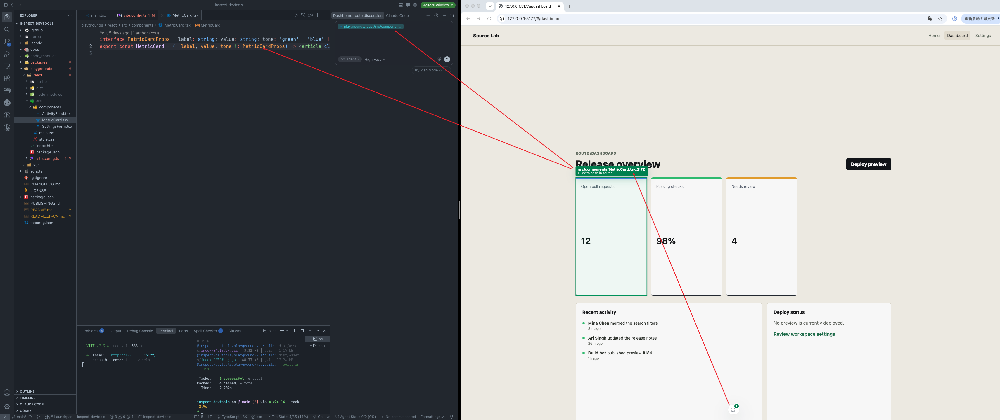

# Inspect Devtools

[English](./README.md)

Inspect Devtools 是一个 Vite 开发期插件，用于从浏览器中定位 React 或 Vue 渲染元素对应的源码。选中元素后，工具会复制源码文件引用，并在编辑器中打开对应文件。

它适合本地调试，也适合把源码文件引用交给同事、写入 issue，或粘贴给编码助手。



## 环境要求

- Vite `6`、`7` 或 `8`
- 运行在 Vite serve 模式下的 React 或 Vue 应用
- 系统环境可被 [`launch-editor`](https://github.com/vitejs/launch-editor) 识别的本地编辑器，或显式配置编辑器命令

## 安装

```bash
pnpm add -D @inspect-devtools/vite-react
# 或
pnpm add -D @inspect-devtools/vite-vue
```

## 配置 Vite

### React

将 Inspect Devtools 放在 React 插件之后。

```ts
// vite.config.ts
import react from '@vitejs/plugin-react'
import { defineConfig } from 'vite'
import { inspectDevtoolsReact } from '@inspect-devtools/vite-react'

export default defineConfig({
  plugins: [react(), ...inspectDevtoolsReact()],
})
```

### Vue

将 Inspect Devtools 放在 Vue 插件之后。

```ts
// vite.config.ts
import vue from '@vitejs/plugin-vue'
import { defineConfig } from 'vite'
import { inspectDevtoolsVue } from '@inspect-devtools/vite-vue'

export default defineConfig({
  plugins: [vue(), ...inspectDevtoolsVue()],
})
```

### 指定编辑器

默认使用当前环境可用的编辑器命令。若需要明确指定，可传入 `openInEditor`。

```ts
plugins: [
  react(),
  ...inspectDevtoolsReact({ openInEditor: 'code' }),
]
```

`inspectDevtoolsVue` 同样支持该选项。

### 主题

dock 与面板默认使用浅色主题。通过 `theme` 可将深色主题设为项目默认。

```ts
plugins: [
  react(),
  ...inspectDevtoolsReact({ theme: 'dark' }),
]
```

dock 中也提供主题切换按钮，选择结果按项目保存在浏览器 `localStorage` 中，作为当前浏览器对 Vite 默认值的个人覆盖。

`inspectDevtoolsVue` 同样支持该选项。

### 复制内容附带路由

复制内容默认保持纯 `@` 引用，让 Cursor 等编码助手能直接识别文件。传入 `copyRoute: true` 后，复制内容会附加一行 `Route:`，包含当前页面的 pathname、search 与 hash（不含 origin），帮助 AI 判断所选元素位于哪个页面、是哪个复用组件的哪个实例，以及该去哪里复现问题。

```ts
plugins: [
  react(),
  ...inspectDevtoolsReact({ copyRoute: true }),
]
```

`inspectDevtoolsVue` 同样支持该选项。

### 复制格式

复制内容默认为 `@` 引用（`copyFormat: 'mention'`），编码助手可直接解析。传入 `copyFormat: 'link'` 则复制标准 Markdown 链接，如 `[App.vue](/绝对路径/App.vue)`——适合粘贴到文档、ticket 或聊天工具等非 AI 目的地。

```ts
plugins: [
  react(),
  ...inspectDevtoolsReact({ copyFormat: 'link' }),
]
```

`inspectDevtoolsVue` 同样支持该选项。

## 使用流程

1. 启动 Vite 开发服务器。
2. 按 `Alt+Shift+I`，或点击底部 dock 中的准星按钮；按钮上的角标会显示当前已选数量。
3. 悬停可预览源码标签；点击目标元素完成选中。拖拽框选可一次选中多个元素：每个命中元素都有独立高亮框，`@` 引用在复制时按源码文件去重（每行一个）。
4. 仿 Photoshop 的加减选让你无需退出 Inspect 模式即可调整选择：`Shift+点击` 或 `Shift+拖拽` 加选元素，`Alt+点击`（macOS 为 `Option+点击`）或 `Alt+拖拽` 减选元素——点击高亮框内任意位置即可移除该框。悬浮时按住 `Shift` 或 `Alt` 会预演操作结果：即将选中的元素显示实线绿框，即将移除的条目罩上红框（`Alt+拖拽` 时选框也会变红）。每次变更都会把当前全部 `@` 引用重新复制到剪贴板。退出 Inspect 模式后选区仍然保留：只要高亮框还在页面上，按住 `Shift`/`Alt` 悬浮同样显示加减选预览，`Shift+点击` 和 `Alt+点击` 也能继续加减选（不带修饰键的悬浮和点击都不会被拦截）；按 `Escape` 清空整个选区。
5. 当元素存在可用源码信息时，选中会自动复制源码文件引用；只有当选择恰好解析到一个源码文件时，才会在配置的编辑器中精确打开对应行列。多文件选择请通过源码标签按钮手动打开当前项。

Copy 生成相对仓库根目录的 `@` 引用，如 `@playgrounds/vue/src/App.vue`（文件在仓库外时为 `@/绝对路径/App.vue`），Cursor、Claude Code 等编码助手都能识别。复制不附带行列信息；行列仅供编辑器打开时精确跳转使用。引用列表之前另起一行 `Route: /dashboard?tab=overview`，标明所选内容位于哪个页面；如需关闭见[复制内容附带路由](#复制内容附带路由)。粘贴到非 AI 工具时可用 `copyFormat: 'link'` 改为 Markdown 链接，见[复制格式](#复制格式)。

反馈与错误以 dock 上方的瞬态 toast 呈现；当元素无法解析出源码文件时，会以 toast 明确提示，不会复制也不会打开编辑器。

## 快捷键

| 快捷键 | 操作 |
| --- | --- |
| `Alt+Shift+I` | 切换 Inspect 模式 |
| Inspect 中 `Shift+点击` / `Shift+拖拽` | 加选元素 |
| Inspect 中 `Alt+点击` / `Alt+拖拽`（macOS 为 `Option`） | 减选元素 |
| Inspect 中按 `Escape` | 退出 Inspect 模式 |
| 已选中时按 `Escape` | 清除选中状态 |

当焦点位于 input、textarea、select 或可编辑元素时，工具不会拦截这些快捷键。

## 源码定位方式

- **React：** 转换后的开发元数据与 React Fiber 调试信息。
- **Vue：** `vite-plugin-vue-inspector` 元数据。

有些元素没有可解析的应用源码，例如浏览器生成节点、第三方输出或框架内部节点。此时不会自动复制，也不会自动打开编辑器。

## 仅开发期运行

Inspect Devtools 只会在 Vite 的 `serve` 模式注入，不会进入生产构建。

## Playground

仓库中提供 React 和 Vue 两个 playground，均包含 Home、Dashboard、Settings 三个 hash 路由，以及嵌套组件、导航、表单控件、状态变化和链接，方便验证选中行为。

```bash
pnpm play:react
pnpm play:vue
```

在两个 playground 中均可访问 `#/`、`#/dashboard`、`#/settings`。

## 本地开发

```bash
pnpm test
pnpm typecheck
pnpm build
```

## 当前范围

- 仅支持 React 与 Vue
- 仅支持 Vite 开发服务器
- 仅支持本地编辑器与剪贴板交接
- 不包含生产环境运行时、AI 服务集成或远程源码定位
